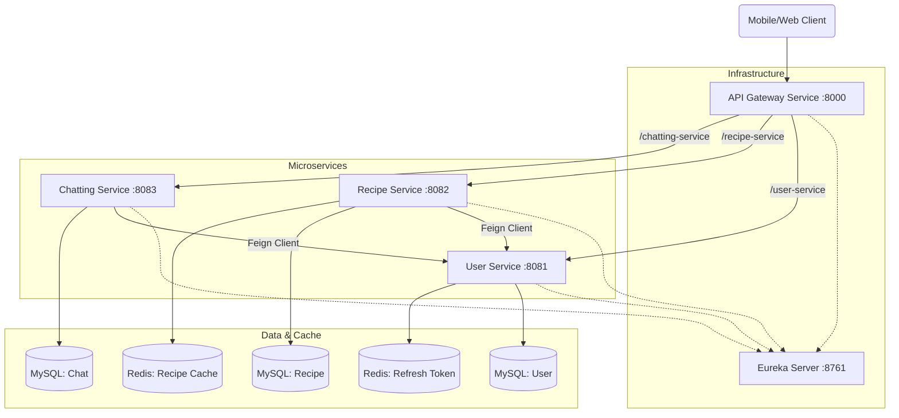

# TastyHub Backend Refactory

**TastyHub Backend Refactory**는 기존 모놀리식 구조의 TastyHub 백엔드 시스템을 MSA(Microservices Architecture)로 전환하여 확장성과 유지보수성을 강화한 프로젝트입니다. Spring Cloud 생태계를 기반으로 구축되었으며, 각 도메인(User, Recipe, Chatting)별로 독립적인 배포와 확장이 가능합니다.

## 🏗 System Architecture
이 프로젝트는 **Netflix Eureka**를 통한 서비스 디스커버리와 **Spring Cloud Gateway**를 통한 단일 진입점 방식을 채택하고 있습니다. 서비스 간 통신은 **OpenFeign**을 사용하며, 데이터 일관성과 성능을 위해 **Redis** 캐싱과 **Circuit Breaker**를 적용했습니다.



## ✨ Key Implementation Features

이 프로젝트의 핵심 기술적 특징들은 다음과 같습니다.

### 1. Robust Authentication & Security (User Service) **Apple OAuth2 Login Implementation**:
* `AppleAuthService`를 통해 Apple 로그인을 직접 구현하였습니다.
* `.p8` Private Key 파일을 사용하여 Client Secret(JWT)을 동적으로 생성(ES256 서명)하고, Apple ID Server와 통신하여 `id_token`을 검증합니다.


* **Custom JWT Security Filter**:
* `JwtAuthFilter`를 `Common` 모듈에 구현하여 모든 서비스에서 일관된 인증 처리를 수행합니다.
* MSA 환경 특성을 고려하여 `UserDetailsService` 로드 실패 시에도 토큰의 클레임(Claims) 정보를 기반으로 `Authentication` 객체를 생성하는 안전 장치(Safe Authentication)를 마련했습니다.


### 2. Resilience & Performance (Recipe Service)* **Circuit Breaker (Resilience4j)**:
* `RecipeServiceImpl`의 `getPopularRecipes`, `getRecipe` 등 조회 로직에 `@CircuitBreaker`를 적용하였습니다.
* DB 부하가 심하거나 장애 발생 시 `fallbackPopularRecipes`와 같은 Fallback 메서드가 실행되어 시스템 전체의 장애 전파를 차단합니다.


* **Redis Caching Strategy**:
* 자주 조회되는 인기 레시피 목록(`popularRecipes`)과 레시피 상세 정보(`recipeDetail`)에 `@Cacheable`을 적용하여 DB 부하를 줄이고 응답 속도를 개선했습니다.
* 데이터 일관성을 위해 레시피 수정(`updateRecipe`) 및 삭제(`deleteRecipe`) 시 `@CacheEvict`를 통해 관련 캐시를 즉시 무효화합니다.


### 3. Real-time Communication (Chatting Service)* **WebSocket & STOMP**:
* `WebSocketConfig`를 통해 `/ws/chat` 엔드포인트를 개설하고 STOMP 프로토콜을 지원합니다.
* Pub/Sub 모델을 기반으로 `/topic`을 구독한 사용자들에게 실시간 메시지 전송을 지원합니다.


* **Message Validation**:
* 메시지 전송 시 송신자가 해당 채팅방의 멤버인지 검증하는 로직(`chatRoomMemberRepository.existsByChatRoomAndUsername`)을 포함하여 보안을 강화했습니다.


### 4. Inter-Service Communication* **Feign Client**:
* `Recipe Service`와 `Chatting Service`에서 작성자 정보(닉네임 등)가 필요할 때, `UserClient`를 통해 `User Service`의 API를 호출합니다. 이를 통해 데이터 중복 저장을 최소화하고 각 서비스의 책임(Bounded Context)을 명확히 했습니다.


## 🛠 Tech Stack###Backend* 

### **Framework**: Spring Boot 3.5.5, Spring Cloud 2025.0.0
* **Language**: Java 21
* **Build Tool**: Gradle

### Database & Infrastructure* **RDBMS**: MySQL 8.0 (Service per Database pattern)
* **NoSQL**: Redis (Caching & Token Storage)
* **Container**: Docker, Docker Compose

### Libraries* **ORM**: Spring Data JPA, QueryDSL 5.0.0
* **Resilience**: Resilience4j
* **Auth**: JJWT (Java JWT)
* **Utils**: Lombok, Jackson

## 🚀 Getting Started###Prerequisites* Java 21
* Docker & Docker Compose

### Installation & Running1. **Clone Repository**
```bash
git clone https://github.com/graduationdku/tastyhub-backend-refactory.git

```


2. **Environment Setup**
* `src/main/resources` 경로에 필요한 `application.yml` 및 Key 파일(Apple Auth Key 등)이 존재하는지 확인합니다.


3. **Run with Docker Compose**
```bash
docker-compose up -d --build

```


* 이 명령어는 MySQL, Redis 컨테이너와 함께 모든 마이크로서비스(Eureka, Gateway, User, Recipe, Chat)를 빌드하고 실행합니다.


4. **Verification**
* **Eureka Dashboard**: [http://localhost:8761](https://www.google.com/search?q=http://localhost:8761)
* **API Gateway**: [http://localhost:8000](https://www.google.com/search?q=http://localhost:8000)


## 📂Project Structure
```text
tastyhub-backend-refactory
├── common                # 공통 모듈 (JWT, Global Exception, Common DTO)
├── service-discovery     # Eureka Server
├── apiGateway-service    # API Gateway
├── user-service          # 사용자 도메인 (OAuth2, JWT, Profile)
├── recipe-service        # 레시피 도메인 (CRUD, Redis Cache, Circuit Breaker)
├── chatting-service      # 채팅 도메인 (WebSocket, STOMP)
└── docker-compose.yml    # 인프라 오케스트레이션 설정

```
